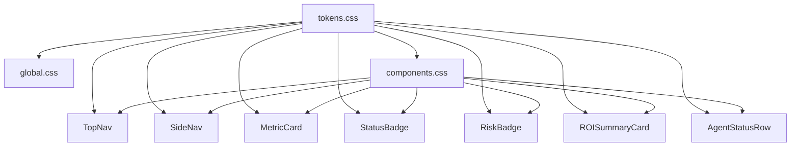

# Design Document: ECHO Command Center UI Polish

## Overview

This is a pure visual/UX polish pass on the existing ECHO Command Center SaaS dashboard. No structural, layout, navigation, or functional changes are made. All work is confined to CSS custom properties, keyframe animations, and inline style refinements across the existing component set.

The goal is to elevate the dashboard to a premium, "Stripe/Vercel/Linear"-tier aesthetic: deeper backgrounds, richer card depth, more prominent KPI numbers, animated live indicators, and tighter typographic consistency — all while preserving every existing token name and component API.

**Stack:** React + TypeScript + Vite, CSS custom properties (`tokens.css`, `global.css`, `components.css`), no Tailwind, Recharts, React Router, Zustand.

---

## Architecture

The design system is layered as follows:

```
tokens.css          ← CSS custom properties (single source of truth)
    ↓
global.css          ← Body/reset styles, keyframe animations
    ↓
components.css      ← Shared component classes (.card, .btn, .data-table, etc.)
    ↓
*.tsx components    ← Inline styles referencing var(--*) tokens
```

All polish changes flow downward through this hierarchy. No new files are created. No component APIs change.



---

## Components and Interfaces

### tokens.css — New Tokens

Five new tokens are added; no existing tokens are renamed or removed:

| Token | Value | Purpose |
|---|---|---|
| `--shadow-card-glow` | `0 0 0 1px rgba(79,163,247,0.12), 0 4px 24px rgba(79,163,247,0.08)` | Accent-colored outer glow for elevated cards |
| `--shadow-inset-subtle` | `inset 0 1px 0 rgba(255,255,255,0.06), inset 0 -1px 0 rgba(0,0,0,0.2)` | Inner highlight/shadow for inset surfaces |
| `--gradient-surface-premium` | `linear-gradient(135deg, #0e1824 0%, #0b1a2e 50%, #0e1f1a 100%)` | Diagonal gradient for hero/premium cards |
| `--color-border-inner` | `rgba(255,255,255,0.06)` | Inner highlight border, distinct from `--color-border` |
| `--transition-micro` | `all 0.12s cubic-bezier(0.4, 0, 0.2, 1)` | Sub-element hover effects, snappier than `--transition-fast` |

### global.css — Body Background + Keyframes

**Body background** is upgraded from 2 radial layers to 3:
- Layer 1: top-center blue ambient (`rgba(79,163,247,0.05)`)
- Layer 2: bottom-right purple ambient (`rgba(167,139,250,0.04)`)
- Layer 3: center vignette (`rgba(0,0,0,0.3)`)
- Layer 4 (texture): SVG noise at ≤3% opacity via `url("data:image/svg+xml,...")`

**New keyframe:** `@keyframes pulse-dot` — scales dot `1→1.4→1`, opacity `1→0.5→1`, 2s infinite.

### components.css — Card, Button, Table Patches

**`.card`** — richer 3-stop gradient background, enhanced `::before` inner highlight, hover lifts 2px with accent glow.

**`.card-premium`** — new modifier: applies `--gradient-surface-premium`, `::after` shimmer line at top edge.

**`.btn-primary/:hover`** — glow increases from `rgba(79,163,247,0.3)` → `rgba(79,163,247,0.45)`, `translateY(-1px)`.

**`.btn-danger/:hover`** — `translateY(-1px)` + `box-shadow: 0 4px 20px rgba(240,72,62,0.5)`.

**`.btn:active`** — `translateY(0)` + reduced shadow (pressed feel).

**`.data-table td`** — padding `12px var(--space-4)`.

**`.data-table th`** — `border-bottom: 1px solid var(--color-border-emphasis)`, `letter-spacing: 0.09em`.

**`.data-table tbody tr:hover`** — `background: var(--color-surface-hover)`, `box-shadow: inset 3px 0 0 var(--color-accent-blue)`.

### TopNav.tsx — Kill Switch Emphasis + Frosted Glass

- `backdrop-filter: blur(24px) saturate(2)` (upgraded from `blur(20px) saturate(1.8)`)
- `box-shadow` upgraded to include `0 4px 32px rgba(0,0,0,0.5)`
- Kill switch button: `minWidth: 130px`, inactive state gets `borderPulse` at 2.5s
- Connection status pill: `minWidth: 80px`
- Avatar hover: adds `1px solid var(--color-border)` border

### SideNav.tsx — Active State + Hover Polish

- Active item: `borderLeft: '3px solid var(--color-accent-blue)'` (upgraded from 2px)
- Active background: `linear-gradient(90deg, rgba(79,163,247,0.14) 0%, rgba(79,163,247,0.03) 100%)`
- Hover: `rgba(255,255,255,0.05)` (upgraded from `0.04`)
- Health bar fill: `box-shadow: 0 0 8px {healthColor}60`
- Icon `filter: drop-shadow(0 0 5px currentColor)` at 70% opacity

### MetricCard.tsx — KPI Prominence

- Value: `font-size: var(--font-size-3xl)`, `font-weight: 800`, `letter-spacing: -0.03em` (already correct per current code — verify `text-shadow` glow is `{accent}40` not `{accent}30`)
- Label: `font-size: 10px`, `font-weight: 700`, `text-transform: uppercase`, `letter-spacing: 0.09em`
- Trend badge: background at 15% opacity, `1px solid {trendColor}30`, arrow prefix
- Accent bar: exactly 3px wide, gradient top→bottom, `box-shadow: 2px 0 10px {accent}33`
- Hover: lifts 2px, glow from `{accent}12` → `{accent}20`

### StatusBadge.tsx — Refinement

- Add `border: '1px solid {color}4D'` (30% opacity hex = `4D`)
- Dot: add `boxShadow: '0 0 6px currentColor'`
- `letterSpacing: '0.04em'`, `fontWeight: 700`
- Pulse animation on dot when status is `HEALTHY`, `APPROVED`, or `PASSED`
- `fontSize: 10px` for `sm`, `11px` for `md`

### RiskBadge.tsx — Severity Differentiation

- All levels: add `border: '1px solid {color}59'` (35% opacity hex = `59`)
- HIGH (≥70): `fontWeight: 800`, `boxShadow: '0 0 8px {color}40'`, uppercase label
- MED (30–69): `fontWeight: 700`, `boxShadow: '0 0 4px {color}25'`
- LOW (<30): `fontWeight: 600`, no box-shadow
- Always render score + `·` + label when `showLabel` is true

### ROISummaryCard.tsx — Premium Hero

- Add `.card-premium` class to outer container
- Total savings: `font-size: var(--font-size-5xl)`, `text-shadow: 0 0 40px rgba(52,208,88,0.5)` (upgrade from 30px/0.4)
- Glow orbs already present — verify opacity ≤10%
- Shimmer line already present — verify gradient matches spec
- Secondary metrics: already at `font-size-3xl` / `font-weight: 800`

### AgentStatusRow.tsx — Pulse-Dot

- Healthy dot: add `animation: 'pulse-dot 2s ease-in-out infinite'` alongside existing `pulse-ring`
- The `pulse-dot` keyframe is defined in `global.css`

---

## Data Models

No data model changes. This feature is purely presentational. All component props, store shape, and API contracts remain identical.

The only "data" concern is CSS custom property values — these are all additive (new tokens) or value-only changes to existing tokens.

---

## Correctness Properties

*A property is a characteristic or behavior that should hold true across all valid executions of a system — essentially, a formal statement about what the system should do. Properties serve as the bridge between human-readable specifications and machine-verifiable correctness guarantees.*

### Property 1: Token backward compatibility

*For any* component that references an existing CSS custom property token by name, after the token file is updated, that component must still resolve the token without falling back to the browser default (i.e., no `var(--foo, fallback)` should be needed for pre-existing tokens).

**Validates: Requirements 1.4**

### Property 2: New tokens are defined

*For any* of the five new token names (`--shadow-card-glow`, `--shadow-inset-subtle`, `--gradient-surface-premium`, `--color-border-inner`, `--transition-micro`), querying the computed style of `:root` must return a non-empty string.

**Validates: Requirements 1.1, 1.2, 1.3, 1.5**

### Property 3: StatusBadge border opacity

*For any* status value passed to `StatusBadge`, the rendered element must have a `border` style whose color alpha channel is approximately 30% of the badge's text color alpha.

**Validates: Requirements 5.1**

### Property 4: RiskBadge severity weight ordering

*For any* pair of risk scores where score A ≥ 70 and score B < 30, the rendered `font-weight` of badge A must be strictly greater than the rendered `font-weight` of badge B.

**Validates: Requirements 6.2, 6.3**

### Property 5: Pulse animation on live statuses

*For any* `StatusBadge` rendered with `dot={true}` and status `HEALTHY`, `APPROVED`, or `PASSED`, the dot element must have an `animation` style that is not `none`.

**Validates: Requirements 5.4, 11.5**

### Property 6: MetricCard value font dominance

*For any* `MetricCard` instance, the computed `font-size` of the value element must be greater than or equal to 28px (i.e., `var(--font-size-3xl)`), and `font-weight` must be 800.

**Validates: Requirements 4.1**

### Property 7: RiskBadge always shows score

*For any* score value in [0, 100], the rendered `RiskBadge` text content must include the numeric score.

**Validates: Requirements 6.5**

---

## Error Handling

Since this feature is purely CSS/style changes with no async operations, data fetching, or business logic, there are no runtime error conditions to handle.

The only failure modes are:

- **Token resolution failure**: A `var(--token)` reference that doesn't resolve falls back to the browser default (usually `initial`). Mitigated by: all new tokens are defined in `:root` before any component references them, and no existing token names are changed.
- **Animation jank**: Heavy `box-shadow` or `backdrop-filter` on low-end hardware. Mitigated by: all animations use `transform` and `opacity` where possible (GPU-composited); `backdrop-filter` is only on the sticky TopNav (single element).
- **CSS specificity conflicts**: New `.card-premium` modifier could conflict with inline styles. Mitigated by: inline styles always win over class styles in React; the modifier only sets `background-image` and `::after` content that inline styles don't override.

---

## Testing Strategy

### Unit Tests

Unit tests focus on specific examples and component rendering correctness:

- `StatusBadge` renders a border style for each status value
- `StatusBadge` applies pulse animation class/style for `HEALTHY`, `APPROVED`, `PASSED`
- `RiskBadge` renders correct `font-weight` for HIGH/MED/LOW score ranges
- `RiskBadge` always includes the numeric score in rendered output
- `MetricCard` renders value at `font-size-3xl` and `font-weight: 800`
- `MetricCard` applies `text-shadow` glow when `accent` prop is provided
- `TopNav` kill switch button has `minWidth: 130px`
- `TopNav` kill switch button has `borderPulse` animation when `killSwitchActive` is false

### Property-Based Tests

Property tests use a PBT library (e.g., **fast-check** for TypeScript) with minimum 100 iterations per property.

Each test is tagged with: `Feature: echo-command-center-ui-polish, Property {N}: {property_text}`

| Property | Test Description |
|---|---|
| P1: Token backward compatibility | Generate random existing token names, assert computed value is non-empty after update |
| P2: New tokens are defined | For each of the 5 new token names, assert computed `:root` value is non-empty |
| P3: StatusBadge border opacity | For any status string in STATUS_CONFIG, render badge and assert border color alpha ≈ 30% of text color |
| P4: RiskBadge severity weight ordering | For any score ≥70 and any score <30, assert rendered font-weight(HIGH) > font-weight(LOW) |
| P5: Pulse animation on live statuses | For any of {HEALTHY, APPROVED, PASSED}, render with dot=true, assert animation is not 'none' |
| P6: MetricCard value font dominance | For any label/value/accent combination, assert value font-size ≥ 28px and font-weight = 800 |
| P7: RiskBadge always shows score | For any integer score in [0,100], assert rendered text includes that score |

**Configuration:**
```ts
// fast-check, minimum 100 runs per property
fc.assert(fc.property(...), { numRuns: 100 });
```
